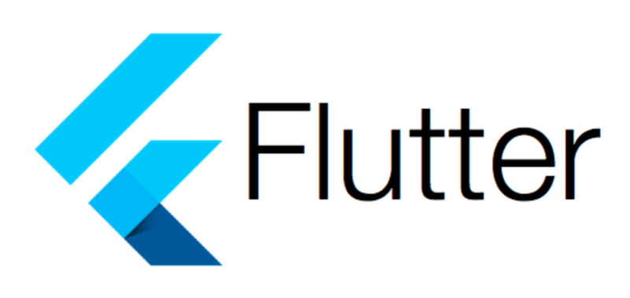

# UI Designs in Flutter
 

This repository contains multiple arractive and eye catching MobileApp UIs design in Flutter/Dart. Every UI code and images are boxed in separate folder with its name.

This project is a starting point for a Flutter application.

A few resources to get you started if this is your first Flutter project:

- [Lab: Write your first Flutter app](https://docs.flutter.dev/get-started/codelab)
- [Cookbook: Useful Flutter samples](https://docs.flutter.dev/cookbook)

For help getting started with Flutter development, view the
[online documentation](https://docs.flutter.dev/), which offers tutorials,
samples, guidance on mobile development, and a full API reference.

 <h2>Food App</h2>
  
  
  

  

  <h2>Weather App Design</h2>
 
  
  

  
  

  <h2>Woman Beauty Product</h2>
 
  
  

  
  

  <h2>Todo App UI</h2>
 
  

  

  <h2>Doctor App UI</h2>
 
  
  
  <h2>Project Management</h2>
 
 

  <h2>Project Management</h2>
 
 
 
  <h2>Shoes App</h2>
 
  
 
 
 <h2>Drone Store App</h2>
  
 
 
  <h2>Car App</h2>
  
 
 
 
